<!-- ═══════════════════════════════════════════════════════════ -->
<!--            1. LIVE TERMINAL — NEOFETCH                     -->
<!-- ═══════════════════════════════════════════════════════════ -->

<h3><code>The Cipher Stack</code></h3>

<table>
  <tr>
    <td valign="top">
      
    </td>
    <td valign="top">
      
    </td>
  </tr>
</table>

 

---

<!-- ═══════════════════════════════════════════════════════════ -->
<!--            2. CINEMATIC HEADER                             -->
<!-- ═══════════════════════════════════════════════════════════ -->

 

&nbsp;

&nbsp;

  

  

---

<!-- ═══════════════════════════════════════════════════════════ -->
<!--            3. LIVE TERMINAL — CONTRIBUTIONS                -->
<!-- ═══════════════════════════════════════════════════════════ -->

<h3><code>Contributions</code></h3>

 

---

<!-- ═══════════════════════════════════════════════════════════ -->
<!--                    FEATURED GALLERY                       -->
<!-- ═══════════════════════════════════════════════════════════ -->

### Featured Gallery — The Best of Hxni
 

<table border="0">
  <tr>
    <td align="center" width="50%">
      
       
      <b>The 3D Nexus</b> 
      Immersive Three.js Portfolio Experience
    </td>
    <td align="center" width="50%">
      
       
      <b>Editorial Excellence</b> 
      Full-Stack Boutique E-commerce Platform
    </td>
  </tr>
  <tr>
    <td align="center" width="50%">
      
       
      <b>Bespoke E-store 2.0</b> 
      Luxury Minimalist Mobile Commerce
    </td>
    <td align="center" width="50%">
      
       
      <b>TicketVerse</b> 
      Premium Full-Stack Event Booking
    </td>
  </tr>
  <tr>
    <td align="center" width="50%">
      
       
      <b>NIXH Social</b> 
      Enterprise Multi-User Directory and Social Engine
    </td>
    <td align="center" width="50%">
      
       
      <b>hxni Express</b> 
      Cinematic Parallax Food Delivery Experience
    </td>
  </tr>
  <tr>
    <td align="center" width="50%">
      
       
      <b>Spice with Hassan</b> 
      Boutique Restaurant and Ordering Management
    </td>
    <td align="center" width="50%">
      
       
      <b>Nixh Food 2.0</b> 
      Scalable Order Tracking and Delivery Ecosystem
    </td>
  </tr>
  <tr>
    <td align="center" width="50%">
      
       
      <b>Hxni Finance</b> 
      Advanced Personal Asset and Expense Management
    </td>
    <td align="center" width="50%">
      
       
      <b>Hxnix Social</b> 
      Modern Interactive Community Engine
    </td>
  </tr>
</table>

---

<!-- ═══════════════════════════════════════════════════════════ -->
<!--                    TECH ARSENAL                           -->
<!-- ═══════════════════════════════════════════════════════════ -->

### Tech Arsenal
 

<table>
<tr>
<td align="center" width="50%">

**Frontend and 3D**

</td>
<td align="center" width="50%">

**Backend and Data**

</td>
</tr>
<tr>
<td align="center">

**Mobile**

 React Native

</td>
<td align="center">

**Tools and DevOps**

</td>
</tr>
</table>

---

<!-- ═══════════════════════════════════════════════════════════ -->
<!--               CURRENTLY BUILDING                          -->
<!-- ═══════════════════════════════════════════════════════════ -->

### What I am Up To

<table>
<tr>
<td><b>Currently Building</b></td>
<td>Full-stack production apps with React + Node.js</td>
</tr>
<tr>
<td><b>Currently Learning</b></td>
<td>Advanced Three.js, WebGL shaders, TypeScript patterns</td>
</tr>
<tr>
<td><b>Ask Me About</b></td>
<td>React architecture, REST API design, 3D web experiences</td>
</tr>
<tr>
<td><b>Fun Fact</b></td>
<td>I have refactored code at 2AM and called it meditation</td>
</tr>
</table>

---

<!-- ═══════════════════════════════════════════════════════════ -->
<!--                  GITHUB ACHIEVEMENTS                      -->
<!-- ═══════════════════════════════════════════════════════════ -->

### GitHub Achievements
 

<table border="0">
  <tr>
    <td align="center" width="25%">
       
      <b>Pair Extraordinaire</b> 
      Co-authored commits
    </td>
    <td align="center" width="25%">
       
      <b>Pull Shark</b> 
      Merged pull requests
    </td>
    <td align="center" width="25%">
       
      <b>YOLO</b> 
      Merged without review
    </td>
    <td align="center" width="25%">
       
      <b>Starstruck</b> 
      Repo with 16+ stars
    </td>
  </tr>
</table>

---

<!-- ═══════════════════════════════════════════════════════════ -->
<!--                    CONNECT SECTION                        -->
<!-- ═══════════════════════════════════════════════════════════ -->

<h3><code>Socials</code></h3>

 

&nbsp;

&nbsp;

  

&nbsp;

&nbsp;

  

<table border="0" cellpadding="0" cellspacing="0">
<tr>
<td align="center" valign="middle" width="180">

**Scan my Portfolio**

</td>
<td align="center" valign="middle">

</td>
</tr>
</table>

 

---

