<!-- ═══════════════════════════════════════════════════════════ -->
<!--            1. LIVE TERMINAL — NEOFETCH                     -->
<!-- ═══════════════════════════════════════════════════════════ -->

<h3><code>⚡ Md. Mehedi Hassan — System Console</code></h3>

<table>
  <tr>
    <td valign="top" align="center">
      
    </td>
    <td valign="top" align="center">
      
    </td>
  </tr>
</table>

 

---

<!-- ═══════════════════════════════════════════════════════════ -->
<!--            2. CINEMATIC HEADER                             -->
<!-- ═══════════════════════════════════════════════════════════ -->

 

&nbsp;

&nbsp;

&nbsp;

  

  

---

<!-- ═══════════════════════════════════════════════════════════ -->
<!--            3. LIVE TERMINAL — CONTRIBUTIONS                -->
<!-- ═══════════════════════════════════════════════════════════ -->

<h3><code>📊 Live Contribution Heatmap</code></h3>

 

---

<!-- ═══════════════════════════════════════════════════════════ -->
<!--            4. FEATURED PROJECT SHOWCASE (DEVMEHEDI.COM)   -->
<!-- ═══════════════════════════════════════════════════════════ -->

<h3><code>🚀 Featured Portfolio Projects & Production Apps</code></h3>

Directly showcased from <a href="https://www.devmehedi.com/">devmehedi.com</a>

 

<table border="0">
  <tr>
    <td align="center" width="50%" valign="top">
      
        
      <b>🏭 Tex Fashion Global — Export Garments Portal</b> 
      100% export-oriented garments manufacturer & buying house platform showcasing knitted, denim, sweaters, and outerwear collections.  
      
      
      
      
        
      <a href="https://texfashionglobal.vercel.app/" target="_blank"><b>[ 🌐 Visit Live Site ↗ ]</b></a>
    </td>
    <td align="center" width="50%" valign="top">
      
        
      <b>🛡️ CyberShield Lab — Cyber Security & Hardening Portal</b> 
      Interactive Cyber Security Hub and Infrastructure Hardening Engine featuring live defense lab simulations for web, VPS servers, and apps.  
      
      
      
      
        
      <a href="https://cybershieldlab.vercel.app/" target="_blank"><b>[ 🌐 Visit Live Site ↗ ]</b></a>
    </td>
  </tr>
  <tr>
    <td align="center" width="50%" valign="top">
      
        
      <b>👑 Muslimah Queen — Premium Modest Fashion</b> 
      High-end e-commerce store for modest fashion featuring Borkhas, Abayas, Khimars, Niqabs, and accessories with online checkout & order tracking.  
      
      
      
      
        
      <a href="https://muslimahqueen.com/" target="_blank"><b>[ 🌐 Visit Live Site ↗ ]</b></a>
    </td>
    <td align="center" width="50%" valign="top">
      
        
      <b>📱 JuktoApp — Digital Identity & Smart Wallet</b> 
      Digital identity and smart wallet platform enabling users to create digital business cards, manage smart wallets, scan QR codes, and connect.  
      
      
      
      
        
      <a href="https://www.juktoapp.com/" target="_blank"><b>[ 🌐 Visit Live Site ↗ ]</b></a>
    </td>
  </tr>
  <tr>
    <td align="center" width="50%" valign="top">
      
        
      <b>🎓 Chorcha — Online Exam & Question Bank Platform</b> 
      Interactive exam and practice platform offering digital courses, question banks, class leaderboards, exam history, and real-time progress analytics.  
      
      
      
      
        
      <a href="https://chorcha.devmehedi.com/" target="_blank"><b>[ 🌐 Visit Live Site ↗ ]</b></a>
    </td>
    <td align="center" width="50%" valign="top">
      
        
      <b>📖 Readers FM — Smart Question Bank & Audio Platform</b> 
      Interactive educational platform featuring smart question banks, audiobooks, online reading library with EPUB/PDF reader, and exam prep.  
      
      
      
      
        
      <a href="https://www.readersfm.com/" target="_blank"><b>[ 🌐 Visit Live Site ↗ ]</b></a>
    </td>
  </tr>
  <tr>
    <td align="center" width="50%" valign="top">
      
        
      <b>🏍️ 2Up Biker Gear — Motorcycle Apparel Store</b> 
      E-commerce platform for premium motorcycle riding gear, jackets, vests, helmets, boots, and biker accessories with online checkout.  
      
      
      
      
        
      <a href="https://www.twoupbikergear.com/" target="_blank"><b>[ 🌐 Visit Live Site ↗ ]</b></a>
    </td>
    <td align="center" width="50%" valign="top">
      
        
      <b>🏘️ AksumBase — Digital Real Estate Marketplace</b> 
      Digital property marketplace across West Africa operating with LutinX API trust verification and multi-country property listings.  
      
      
      
      
        
      <a href="https://aksumbase.com/" target="_blank"><b>[ 🌐 Visit Live Site ↗ ]</b></a>
    </td>
  </tr>
</table>

---

<!-- ═══════════════════════════════════════════════════════════ -->
<!--            5. TECH ARSENAL & SKILLS                       -->
<!-- ═══════════════════════════════════════════════════════════ -->

<h3><code>💻 Tech Arsenal & Capabilities</code></h3>
 

<table>
<tr>
<td align="center" width="50%">

**📱 Mobile & Cross-Platform**  

 React Native (Expo Router) · Redux Toolkit · NativeWind · Cross-Platform Mobile Apps

</td>
<td align="center" width="50%">

**🌐 Frontend Architecture**  

 Next.js 15 · React 19 · Three.js 3D · TypeScript · Tailwind CSS

</td>
</tr>
<tr>
<td align="center" width="50%">

**⚙️ Backend, Microservices & Databases**  

 Node.js · Express · NestJS · Prisma · PostgreSQL · MongoDB · Redis

</td>
<td align="center" width="50%">

**🛠️ Cloud, DevOps & Design Tools**  

 Docker · AWS · GitHub Actions · Postman · Linux VPS · Figma UI/UX

</td>
</tr>
</table>

---

<!-- ═══════════════════════════════════════════════════════════ -->
<!--            6. GITHUB ECOSYSTEM ANALYTICS                  -->
<!-- ═══════════════════════════════════════════════════════════ -->

<h3><code>📈 GitHub Activity & Streak Metrics</code></h3>
 

&nbsp;

  

&nbsp;

---

<!-- ═══════════════════════════════════════════════════════════ -->
<!--            7. CONNECT SECTION                             -->
<!-- ═══════════════════════════════════════════════════════════ -->

<h3><code>📬 Let's Connect & Build Something Great</code></h3>
 

&nbsp;

&nbsp;

&nbsp;

&nbsp;

  

<table border="0" cellpadding="0" cellspacing="0">
<tr>
<td align="center" valign="middle" width="180">

**Visit devmehedi.com**  

</td>
<td align="center" valign="middle">

</td>
</tr>
</table>

 

---

